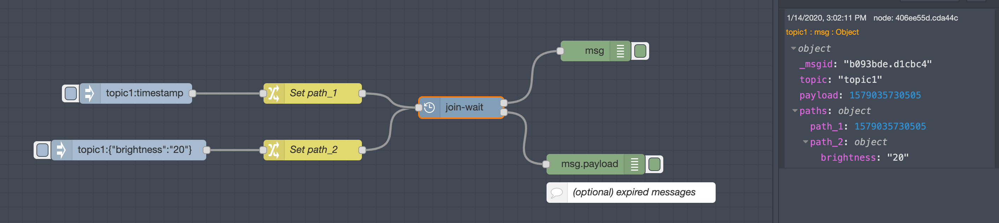
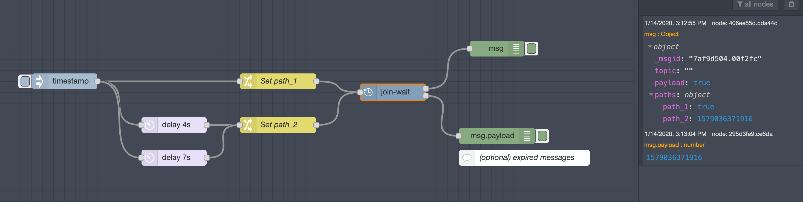

# Node RED join-wait

This Node-RED module waits for incoming messages from different input paths to arrive within a fixed time window.

> Node-RED is a tool for wiring together hardware devices, APIs and online services in new and interesting ways.

## Description

This node waits for messages from all items in the `Paths` array, which must be received inside of a designated time window.

If all of the messages are received in that interval, a merged output is sent to the `success` output. Otherwise, any expired messages are sent to the `timeout` output. Either output can be optionally connected for further processing.

In the event of multiple/duplicate messages, the time window is adjusted as needed to continue evaluation on subsequent messages. This node has several potential applications, including home automation. For instance, to handle a case where the light turning on/off is also triggering a motion sensor: IF a) light turned OFF, b) motion sensor activated, c) light turned ON all occur within 10 seconds, then turn light OFF.

## Configuration

- Each item in the `Paths` array corresponds with an input path to wait for. E.g., `["path_1", "path_2", "other_path"]`.

> This can also be configured at runtime by passing an array using `msg.pathsToWait`.

- `Paths topic` is a `msg` variable used to check each flow to see if all of the elements in `Paths` are matched. This can be `msg.topic`, `msg.paths`, etc. If this is not specified, `msg.paths` will be assumed.

Note that `Paths topic` can be set in one of two ways:
1. As a string, set to the path to check, e.g., `msg.paths = "path_1";`
2. As an object, set to any value (e.g., `msg.paths["path_1"] = {"example": "data"};` or `msg.paths["path_1"] = 42;`).

> If an object is used, multiple paths can be specified. This can be useful if one flow needs to trigger multiple paths.

- `Correlation topic` can be set, if desired, to a variable to ensure that only related messages are grouped. E.g., `msg._msgid` can be used to ensure that only messages from a *single* split flow are grouped together.

> If left blank, all messages will be assumed to be related.

- `Timeout` in milliseconds is required to designate the time window to receive all of the messages from `Paths`.

- `Sequence order` defines the criteria to evaluate the received messages. If multiple messages arrive, e.g., `["path_1", "path_2", "path_2", "path_1", "path_2", "path_2" "path_3"]`, the *exact* match is only triggered for this sequence: `["path_1", "path_2", "path_2" "path_3"]`.

- `Base message` defines which message object should be returned as the base message. Either the first message in a sequence or the last.

- `Merged data` defines how the data from `msg.paths` (or, another designed `Paths topic`) will be returned. Either, it can be merged in its original form, or, it can be overwritten with each respective `msg.payload`. This merged data is then appended to the `Base message`.

## Caveats

- Only the data from a single `Paths` item is returned. E.g., if two `path_2` messages arrive, only the data from the final one will be returned.

- If `msg.pathsToWait` is used instead of setting `Paths`, note that each successive `msg.pathsToWait` will overwrite the previously stored global value. Due to the nature of the timeout, these `Paths` need to be able to be evaluated even after a message has arrived. Using a runtime `msg.pathsToWait` along with different `Correlation topics` may cause unexpected behavior.

- The `timeout` should be padded with a small amount of overhead (i.e., ~5 ms or so) for the time it takes to evaluate all of the messages and conditions. This may become critical under very short timeouts.

## Example 1: Wait 5000ms for input from 2 flows (in any order)

- A custom property, like `msg.topic`, can be used as the **Correlation topic**.



```javascript
[{"id":"95dcbbf2.e887e8","type":"inject","z":"fb783323.7e308","name":"","topic":"topic1","payload":"{\"brightness\":\"20\"}","payloadType":"json","repeat":"","crontab":"","once":false,"onceDelay":"","x":1630,"y":1400,"wires":[["8873e640.5610e8"]]},{"id":"406ee55d.cda44c","type":"debug","z":"fb783323.7e308","name":"","active":true,"tosidebar":true,"console":false,"complete":"true","x":2290,"y":1260,"wires":[]},{"id":"7e5d55cd.bc182c","type":"inject","z":"fb783323.7e308","name":"","topic":"topic1","payload":"","payloadType":"date","repeat":"","crontab":"","once":false,"onceDelay":"","x":1640,"y":1320,"wires":[["30c4bfcb.fde0f"]]},{"id":"295d3fe9.ce6da","type":"debug","z":"fb783323.7e308","name":"","active":true,"tosidebar":true,"console":false,"tostatus":false,"complete":"payload","targetType":"msg","x":2290,"y":1420,"wires":[]},{"id":"30c4bfcb.fde0f","type":"change","z":"fb783323.7e308","name":"Set path_1","rules":[{"t":"set","p":"paths","pt":"msg","to":"path_1","tot":"str"}],"action":"","property":"","from":"","to":"","reg":false,"x":1890,"y":1320,"wires":[["1555120c.6d25be"]]},{"id":"8873e640.5610e8","type":"change","z":"fb783323.7e308","name":"Set path_2","rules":[{"t":"set","p":"paths","pt":"msg","to":"path_2","tot":"str"}],"action":"","property":"","from":"","to":"","reg":false,"x":1890,"y":1400,"wires":[["1555120c.6d25be"]]},{"id":"1555120c.6d25be","type":"join-wait","z":"fb783323.7e308","name":"","paths":"[\"path_1\", \"path_2\"]","pathTopic":"paths","pathTopicType":"msg","correlationTopic":"topic","correlationTopicType":"msg","timeout":"5000","exactOrder":"false","firstMsg":"true","mapPayload":"true","x":2100,"y":1340,"wires":[["406ee55d.cda44c"],["295d3fe9.ce6da"]]},{"id":"1d08ce54.3daa92","type":"comment","z":"fb783323.7e308","name":"(optional) expired messages","info":"","x":2340,"y":1460,"wires":[]}]
```

## Example 2: Wait 5000ms for input from a split flow (in any order); one message does not arrive in time

- `_msgid` can be used as the **Correlation topic**, so that flows from split queues can be tracked.



```javascript
[{"id":"406ee55d.cda44c","type":"debug","z":"fb783323.7e308","name":"","active":true,"tosidebar":true,"console":false,"complete":"true","x":2290,"y":1260,"wires":[]},{"id":"7e5d55cd.bc182c","type":"inject","z":"fb783323.7e308","name":"","topic":"","payload":"","payloadType":"date","repeat":"","crontab":"","once":false,"onceDelay":"","x":1500,"y":1320,"wires":[["30c4bfcb.fde0f","ceab1b9c.ffdfe8","f43ddb51.4db478"]]},{"id":"295d3fe9.ce6da","type":"debug","z":"fb783323.7e308","name":"","active":true,"tosidebar":true,"console":false,"tostatus":false,"complete":"payload","targetType":"msg","x":2290,"y":1420,"wires":[]},{"id":"30c4bfcb.fde0f","type":"change","z":"fb783323.7e308","name":"Set path_1","rules":[{"t":"set","p":"paths","pt":"msg","to":"path_1","tot":"str"},{"t":"set","p":"payload","pt":"msg","to":"true","tot":"bool"}],"action":"","property":"","from":"","to":"","reg":false,"x":1890,"y":1320,"wires":[["1555120c.6d25be"]]},{"id":"8873e640.5610e8","type":"change","z":"fb783323.7e308","name":"Set path_2","rules":[{"t":"set","p":"paths","pt":"msg","to":"path_2","tot":"str"}],"action":"","property":"","from":"","to":"","reg":false,"x":1890,"y":1400,"wires":[["1555120c.6d25be"]]},{"id":"1555120c.6d25be","type":"join-wait","z":"fb783323.7e308","name":"","paths":"[\"path_1\", \"path_2\"]","pathTopic":"paths","pathTopicType":"msg","correlationTopic":"_msgid","correlationTopicType":"msg","timeout":"5000","exactOrder":"false","firstMsg":"true","mapPayload":"true","x":2100,"y":1340,"wires":[["406ee55d.cda44c"],["295d3fe9.ce6da"]]},{"id":"1d08ce54.3daa92","type":"comment","z":"fb783323.7e308","name":"(optional) expired messages","info":"","x":2340,"y":1460,"wires":[]},{"id":"ceab1b9c.ffdfe8","type":"delay","z":"fb783323.7e308","name":"","pauseType":"delay","timeout":"4","timeoutUnits":"seconds","rate":"1","nbRateUnits":"1","rateUnits":"second","randomFirst":"1","randomLast":"5","randomUnits":"seconds","drop":false,"x":1700,"y":1400,"wires":[["8873e640.5610e8"]]},{"id":"f43ddb51.4db478","type":"delay","z":"fb783323.7e308","name":"","pauseType":"delay","timeout":"7","timeoutUnits":"seconds","rate":"1","nbRateUnits":"1","rateUnits":"second","randomFirst":"1","randomLast":"5","randomUnits":"seconds","drop":false,"x":1700,"y":1460,"wires":[["8873e640.5610e8"]]}]
```

## :question: Get Help

For bug reports and feature requests, open issues. :bug:

## Installation

First of all, install [Node-RED](http://nodered.org/docs/getting-started/installation)

```sh
# Then open  the user data directory `~/.node-red`  and install the package
$ cd ~/.node-red
$ npm install node-red-contrib-join-wait
```

Or search for `join-wait` in the manage palette menu

## How to contribute

Have an idea? Found a bug? Contributions and pull requests are welcome.

## Support my projects

I try to reply to everyone needing help using these projects. Obviously, this takes time. However, if you get some profit from this or just want to encourage me to continue creating stuff, there are few ways you can do it:

-   Starring and sharing the projects you like :rocket:
-   [![PayPal][badge_paypal]][paypal-donations] **PayPal**— You can make one-time donations via PayPal.
-   **Bitcoin**— You can send me Bitcoin at this address: `33sT6xw3tZWAdP2oL4ygbH5TVpVMfk9VW7`

## Credits

-   Thanks to mauriciom75's https://github.com/mauriciom75/node-red-contrib-wait-paths

## MIT License

[badge_paypal]: https://img.shields.io/badge/Donate-PayPal-blue.svg
[paypal-donations]: https://paypal.me/ddcaspi
